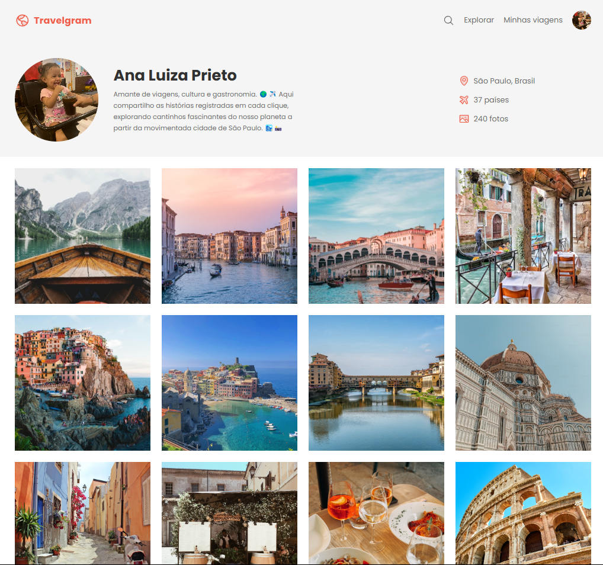

<h1 align="center"> Travelgram </h1>

  <a href="#-tecnologias">Tecnologias</a>&nbsp;&nbsp;&nbsp;|&nbsp;&nbsp;&nbsp;
  <a href="#-projeto">Projeto</a>&nbsp;&nbsp;&nbsp;|&nbsp;&nbsp;&nbsp;
  <a href="#memo-licença">Licença</a>

  

 

  

## 🚀 Tecnologias

Esse projeto foi desenvolvido com as seguintes tecnologias:

- HTML e CSS
- JavaScript
- Git e Github
- Figma

## 💻 Projeto

O Travelgram foi um layout desenvolvido como projeto final da Escola de Programadores - Nível 1. O objetivo desse projeto foi atender aos critérios estabelecidos pelo professor Mago, que incluíam:

<ul>

  <li>Estrutura com header, main e footer.</li>
  <li>Utilização de divs.</li>
  <li>Aplicação de CSS para estilização.</li>
  <li>Organização e estruturação limpa e eficiente do código.</li>

</ul>

O projeto buscou consolidar os conhecimentos adquiridos durante o curso e demonstrar boas práticas de desenvolvimento web.

- [Acesse o projeto finalizado, online](https://github.com/Gestao-de-Performance/projeto-final-PhelipePrieto)

## :memo: Licença

Esse projeto está sob a licença MIT.
